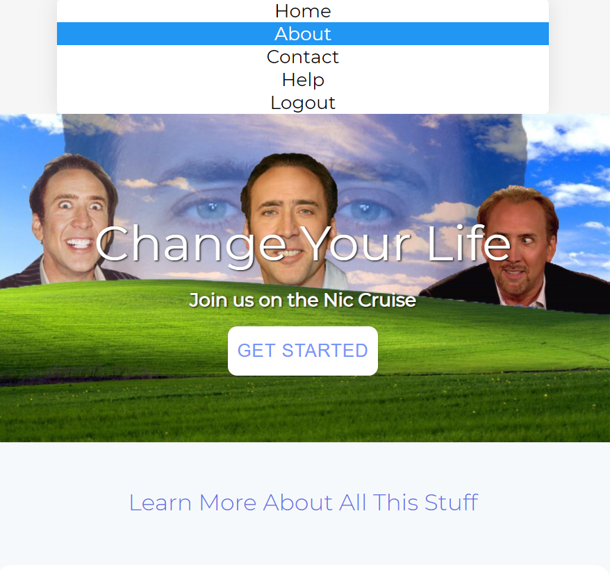

# Nic Page Exercise

Let's create a site where we use flex in a few of different places. You can use the reference images for example but your site doesn't have to be about Nic cage.

- Use flex for the navbar

- Use flex for changing some sections from rows/coluums.

- you could use it to align/justify content in the hero section.

